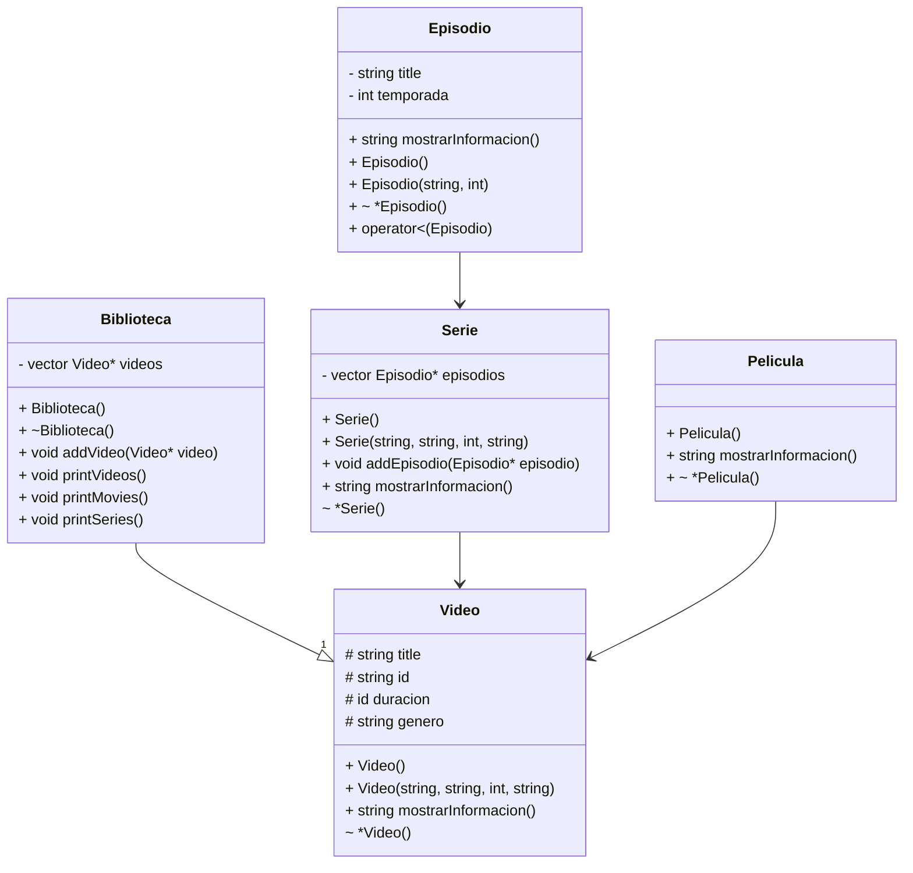

## Información sobre el proyecto

### Comandos de git
```
git add .
git commit -m "Mensaje de cambio"
git push origin main
```
```
git branch newBranch 
git checkout newBranch
```

*El menú principal del programa se encuentra por lo pronto en Exercise.cpp pero se planea moverlo a VideoStreamingApp.cpp y usar Exercise.cpp como una instance de toda la aplicación*

### Diagrama UML

_(Es un trabajo en progreso)_
