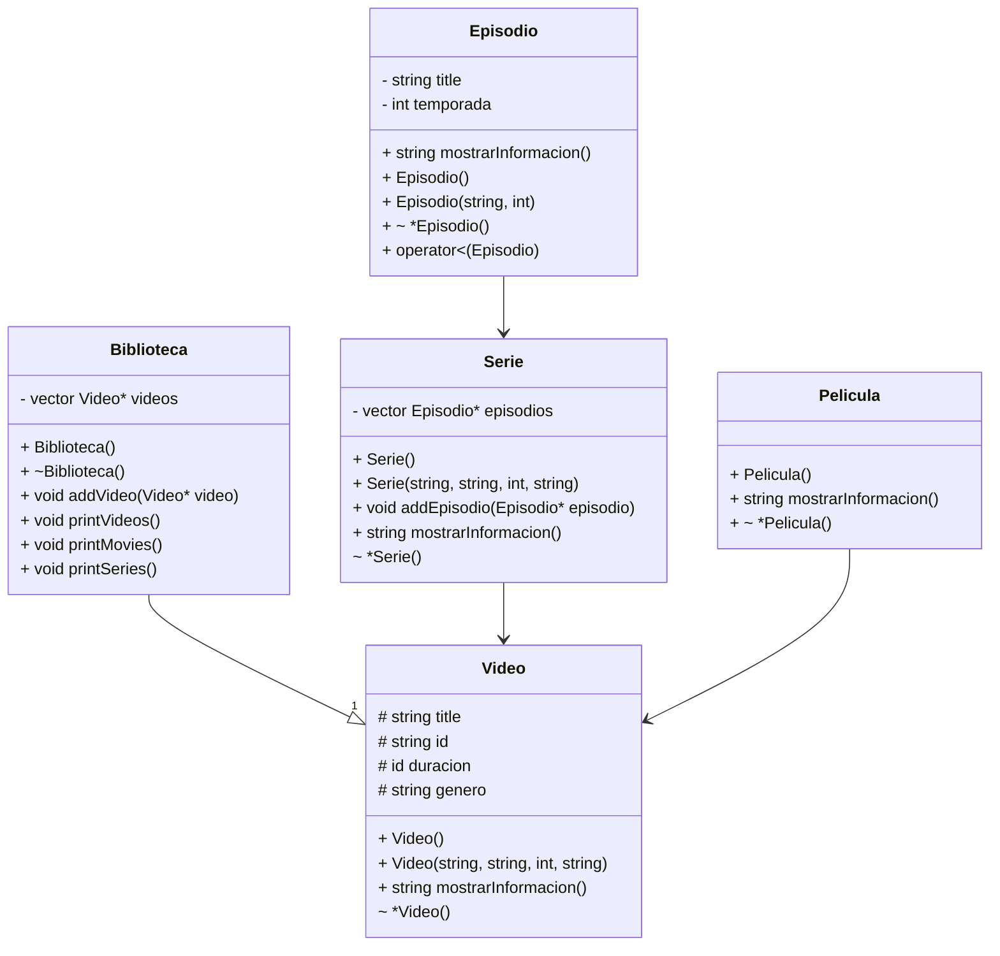

# Situación Problema - App de VideoStreaming

## Modelado de servicio de streaming
En los últimos años, han proliferado los servicios de streaming de video bajo demanda por ejemplo Netflix, Disney, DC entre otros. Algunos de ellos se especializan por el volumen de videos que proporcionan a sus usuarios mientras que otros se han puesto el reto de mostrar solamente videos de su propia marca. Una versión limitada para apoyar a un futuro proveedor de este tipo de servicios es la que se describe a continuación:

Se quiere trabajar con dos tipos de videos: películas y series. Todo video tiene un ID, un nombre, una duración y un género (drama, acción, misterio).

Las series tienen episodios y cada episodio tiene un título y temporada a la que pertenece.

Nos interesa conocer la calificación promedio que ha recibido cada uno de los videos. Esta califiación está en escala de 1 a 5 donde 5 es la mejor calificación.

El sistema debe ser capaz de :

- Mostrar los videos en general con sus calificaciones
- Mostrar los episodios de una determinada serie con sus calificaciones
- Mostrar las películas con sus calificaciones

¿Cuál sería el Diagrama de clases que representaría la situación planteada?

¿Cómo emplearías los conceptos de Programación Orientada a Objetos tales como herencia, polimorfismo y sobrecarga de operadores para construir el sistema de clases que facilitaría la solución de la situación problema?

¿Podrías construir una aplicación que tome la información sobre los diferentes tipos de videos y genere reportes como: películas de un cierto género, series de un cierto género, películas con su calificación ?

## Diagrama de Clases

_Sin terminar:_ 
